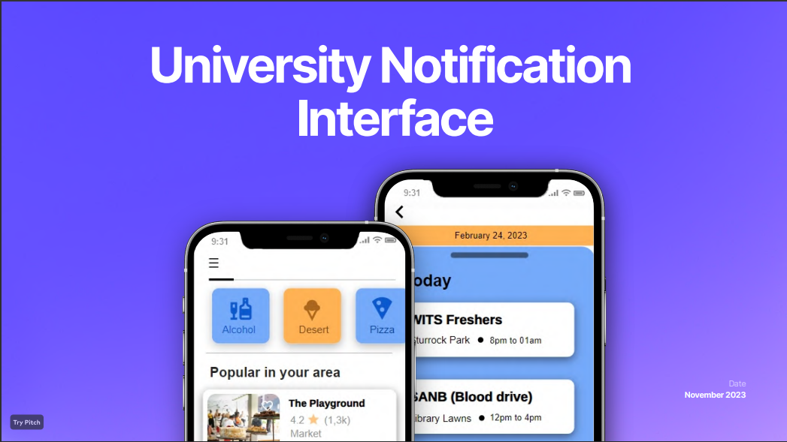
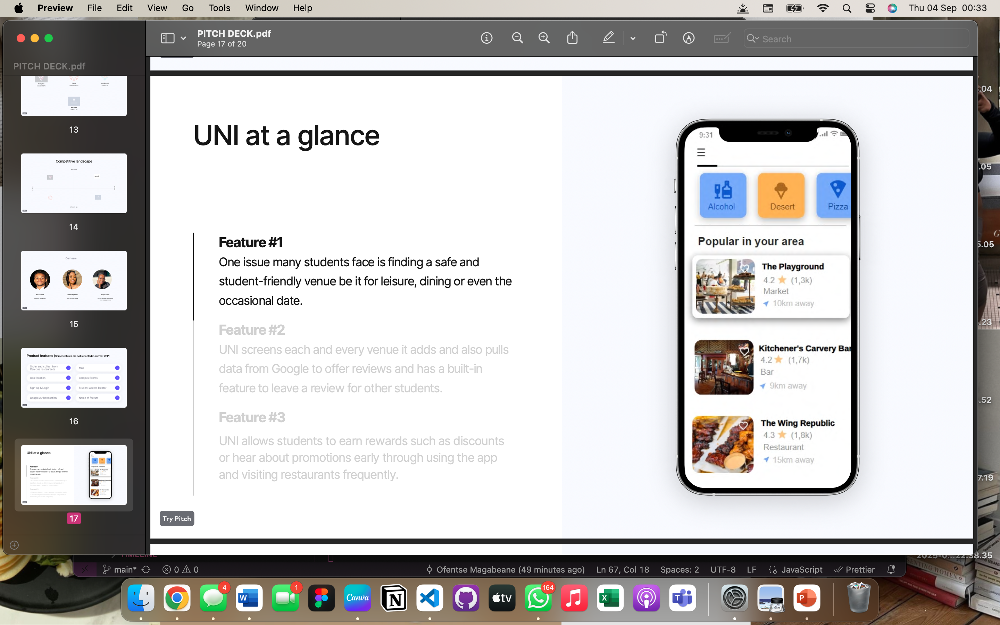

# UNII Student Lifestyle App

# 📱 UNII Student App (Demo)

**Created:** 2023  
**Tools:** React, Figma, Expo, GitHub  
**Role:** UX/UI Designer & Front-End Developer

---

##  What Is This App?

UNII is a mobile app prototype designed to help **Wits University students** manage campus life more easily.

It combines essential features into one easy-to-use platform:

- 🗺️ **Campus Map** – Navigate buildings and lecture halls  
- 🍔 **MatrixGO** – Order food from on-campus vendors  
- 📅 **Campus Events** – Stay updated on academic and social happenings  
- 📍 **Local Hotspots** – Find safe, affordable places around campus

The app was built based on student feedback to reduce stress, save time, and create a more connected campus experience.

---

## Screenshots

```markdown




